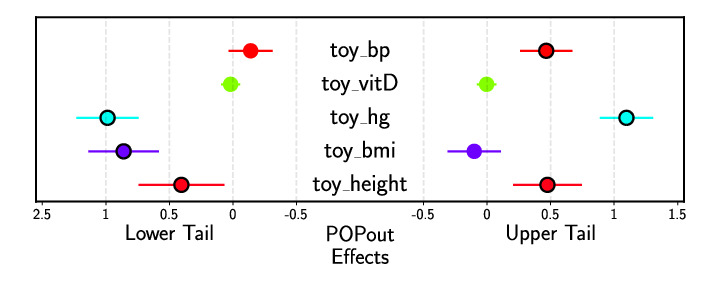
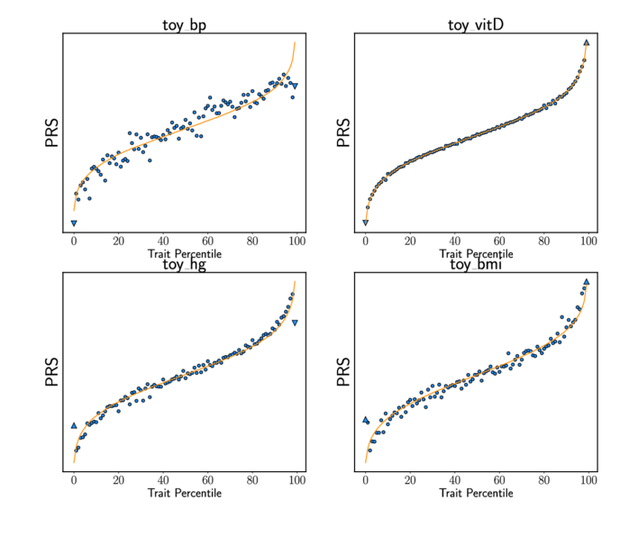

# Interpreting results 

Running the python3 commands described in the previous page will produce the following figure 
(test-effects.pdf) the shows trait POPout Effect Sizes: 

 

It will also produce a figure displaying the POPout distributions for each trait (test-dists.pdf): 

 

Finally, it will also produce an output file (test-results.txt) that displays the POPout test 
results with one row per trait.  Running the R script will also produce this output. 

For more information on the output file format see [Guide: Output Data](guide_output.md).

